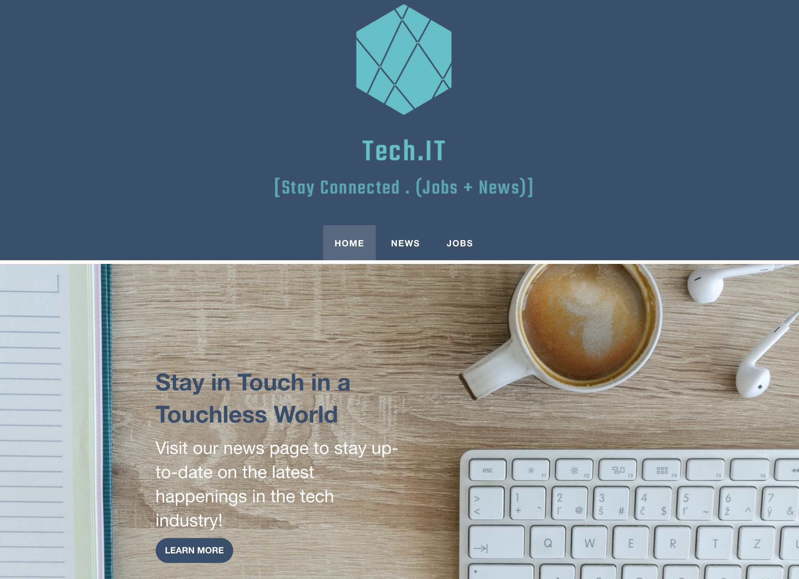

# Tech.IT

## Description 
Website dedicated to technology news and jobs. 

## Usage
* When opening the page, the user is presented with two main heroes for news and jobs respectively, and a timed generated quotes section
* When the user clicks on News, it is presented with the News page that contains 8 latest news in the category of technology
* Each article contains: headline, description, author, date updated, news article image and when the user clicks everywhere in the article, it is send to that news article in a new tab in order to fully read it
* When the user clicks on Jobs, it is presented with the Jobs page that contains 8 latest jobs in category related to technology
* Each job section contains: company name, job title description, date published, images and when the user clicks everywhere in the job section, it is send to that job description in a new tab to fully read it
* When entering email in the footer input field, the user is able to submit the email and emails are stored in local storage
* In the development team section of the footer, each developer has linkedIn and gitHub logos assigned, which sends you to each developer's profile in these medias

## Technology used
* Foundation : https://get.foundation/templates.html
* News API: https://api.nytimes.com/svc/topstories/v2/technology.json?api-key=ApiKey
* Jobs API: https://www.themuse.com/api/public/jobs?category=Business%20%26%20Strategy&category=Creative%20%26%20Design&category=Data%20Science&category=Project%20%26%20Product%20Management&category=Social%20Media%20%26%20Community&page=5&descending=false
       
## Image

## Links
* GitHub Repository: https://github.com/StudyGroup2021/tech.it.git
* GitHub Pages: https://studygroup2021.github.io/tech.it/index.html

## Development Team

@. Enxhi Salaj
@. Megan Carnaghi
@. Pierce Rogg
@. Marlee Eyre
@. Muneeb Ali
@. Alex Tatum
 © Copyright 2020
